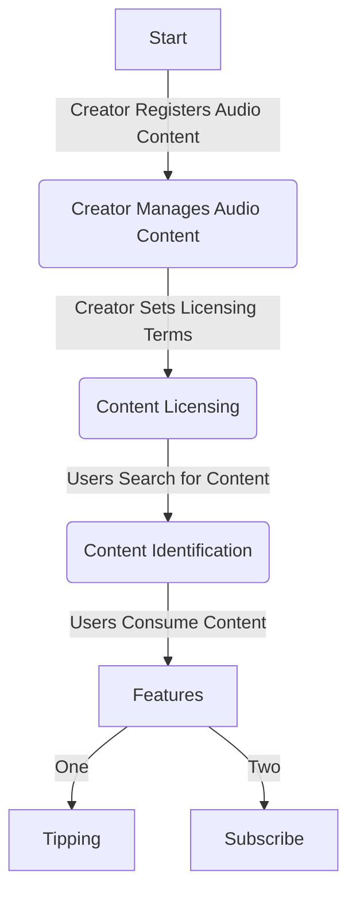

# Story-Pods

## 📣 **Project Overview:**

**[Demo](https://frontend-delta-lovat.vercel.app/)** | 
Own your podcasts! Attest your episodes with Story Protocol and enjoy royalty from your creation. Let your users support your content,
  

## 🎧 **Project Objective:**

An integrated podcast platform for creators and podcast listeners. Creators can use the StoryPods dapp to register their episodes as an IP and license it. Another creator can easily remix this episode and create a derivate of it. Users can tip an episode they love and this revenue is shared among the creators according to the royalty terms.
  

## 🛠️ Key Features:
### Attribution for Creator:

> Built an attribution layer with story protocol to original creators of audio assets and manage licensing and usage rights.
  
 • **Registration and Management:** Provide creators with the ability to register and manage their audio content.
 
 • **Licensing System:**  Established a licensing system for audio content to enable copyright protection and commercial use.
 
 • **Remix System:**  Provided an ethical framework for creators to use original content to create a remix of it, with standard rules and license set by the original creator - Commercial Remix License.
 
 • **Royalty System:**  Enable a royalty for remixed audio content for earning from deviates of an original IP.
  
### User Experience Enhancement for Listener:

> Offers a user-friendly interface for both creators and listeners.

 • A user can stream podcasts and listen to them seamlessly.

 • A user can support a creator with mini-tips specific to each episode.
 
 • A user can choose to support a podcast with erc20 tokens which is directly shared with the creators.
  
## ✨ Future Strategies:

1. Initially market to  podcast creators and small content producers, later scaling to larger entities such as music labels.
2. Implement search functionality and licensing system while improving user experience.
3. Revenue : Implement a revenue model for the protocol with minimal fee for handling disputes after registering.
4. Decentralization: Implement a DAO to handle highly sensitive disputes.
---

## 🎸 **Flowchart:**

> **Start**

1. Creator Registers Audio Content

- Creator provides details of the audio content such as title, description, and tags.
- Content is registered onto the platform's IP layer.
    
  > **Creator Manages Audio Content**

2. Creator Sets Licensing Terms

- Creator specifies licensing terms for the audio content, including usage rights, commercial use, and royalties if applicable.
    
  > **Content Licensing**

3. Users Search for Content

- Users browse or search for audio content based on keywords, tags, or categories.
    
  > **Content Identification**

4. Users Consume Content

- Users listen to or download the audio content.
- Copyright information and creator attribution is displayed.
    
  > **Tipping Feature**

5. Users Send Tips to Creators

- Users have the option to send tips or donations to creators as a form of appreciation.
    

---

## 🎼 **Additional Features (Planned for Future Updates):**

- **Subscription Model:**
  - Integrate the subscription model with Story Protocol's licensing module. Creators can set up subscription-based revenue models through Story Protocol.
- **Ownership Management:**
  - Enable creators to manage ownership of their content effectively through Story Protocol. This strengthens creator rights and ensures clear ownership.
- **Revenue Model Selection:**
  - Utilize Story Protocol to offer creators options for selecting revenue models, such as free or subscription-based models. This empowers creators to choose the revenue model that best fits their needs.
