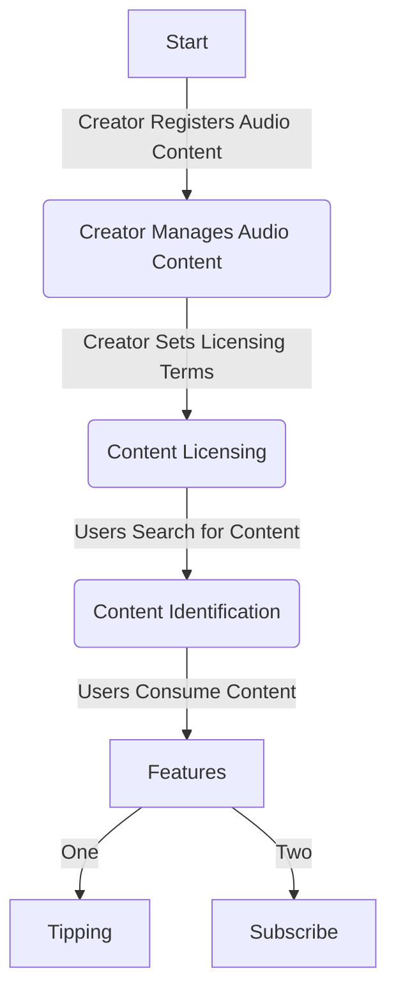

# Story-Podcast-Dapp

## 📣 **Project Overview:**

The Story Podcast project is an integrated platform designed to effectively manage, license, protect, and monetize audio content. Its key features include registration and management, licensing system, content search and identification, attribution, platform transactions, and tipping functionality. This project aims to support creators in managing and monetizing their content while fostering content protection and collaboration through an efficient and integrated solution.
  

## 🎧 **Project Objective:**

The goal of this project is to develop an integrated platform for effectively managing, licensing, protecting, and monetizing podcasts and other audio content for creators.
  

## 🎶 **Key Features:**

1. **Registration and Management:**
   - Creators can register their audio content onto Story Protocol's IP layer, making it easier to manage and protect original works. This ensures clear attribution and facilitates licensing and usage rights management.
2. **Licensing System:**
   - The licensing system will be integrated with Story Protocol's licensing module. Creators can set transparent licensing terms via Story Protocol, allowing for secure content sharing and revenue generation.
3. **Content Search and Identification:**
   - Enhance content search and identification by leveraging Story Protocol's search module. Utilize tags, keywords, and metadata to identify original content and prevent copyright infringement.
4. **Attribution:**
   - Utilize Story Protocol to specify the original creators of audio assets and manage licensing and usage rights. This ensures clear attribution of content and protects creator rights.
5. **Tipping Feature:**
   - Implement the tipping feature using Story Protocol's transaction capabilities. Users can send tokens to podcast creators to support and reward them.
6. **User Experience Enhancement:**
   - Develop a user-friendly interface utilizing Story Protocol's transaction processing and data storage capabilities to enhance the user experience.

---

## 🎸 **Flowchart:**

> **Start**

1. Creator Registers Audio Content

- Creator provides details of the audio content such as title, description, and tags.
- Content is registered onto the platform's IP layer.
    
  > **Creator Manages Audio Content**

2. Creator Sets Licensing Terms

- Creator specifies licensing terms for the audio content, including usage rights, commercial use, and royalties if applicable.
    
  > **Content Licensing**

3. Users Search for Content

- Users browse or search for audio content based on keywords, tags, or categories.
    
  > **Content Identification**

4. Users Consume Content

- Users listen to or download the audio content.
- Copyright information and creator attribution is displayed.
    
  > **Tipping Feature**

5. Users Send Tips to Creators

- Users have the option to send tips or donations to creators as a form of appreciation.
    

---

## 🎼 **Additional Features (Planned for Future Updates):**

- **Subscription Model:**
  - Integrate the subscription model with Story Protocol's licensing module. Creators can set up subscription-based revenue models through Story Protocol.
- **Ownership Management:**
  - Enable creators to manage ownership of their content effectively through Story Protocol. This strengthens creator rights and ensures clear ownership.
- **Revenue Model Selection:**
  - Utilize Story Protocol to offer creators options for selecting revenue models, such as free or subscription-based models. This empowers creators to choose the revenue model that best fits their needs.

---

## 🔊 **Future Strategies:**

1. Initially target podcast creators and small content producers, with future plans to expand to larger entities such as music labels.
2. Technically enhance search functionality and the licensing system, continuously improving user experience to enhance service quality.

This detailed project aims to support creators and users in effectively managing content and generating revenue, while promoting content protection and collaboration.
